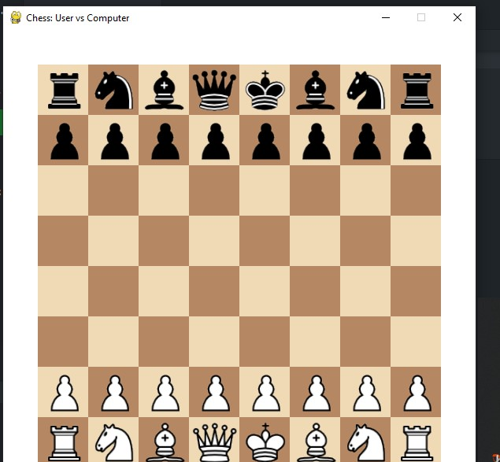

# ♟️ Chess: User vs Computer (Pygame Edition)

This is a graphical chess game built with **Python**, **Pygame**, and **python-chess**, where you (the user) play as **White** against a simple AI (Black). The game is intuitive, interactive, and features highlights for selected pieces and legal moves.

<p align="center">
  
</p>

---

## 🧠 Algorithm Behind the AI

The computer opponent uses a **basic rule-based algorithm**:

* Prioritizes **capture moves** (especially safe captures).
* Then looks for **checks**.
* Falls back to **any legal move** if no capture or check is available.
* This is not a full-fledged engine like Stockfish; it's meant for casual gameplay and understanding turn-based logic.

---

## 🛠️ Requirements

Before running the game, make sure you have the following libraries installed:

```bash
pip install pygame python-chess
```

You must also have **Python 3.7+** installed.

---

## ▶️ How to Run the Game

1. **Clone or Download this repository** to your local machine.

2. Make sure your working directory contains all chess piece image files:

   * `wp.png`, `bp.png`, `wr.png`, `br.png`, `wn.png`, `bn.png`, etc.
   * These images must be named in lowercase: e.g., `wp.png` for White Pawn, `bk.png` for Black King.

3. Run the game using:

```bash
python chess_game.py
```

---

## 🎮 How to Play

* You play as **White**.
* The computer will play as **Black**.
* Use your **mouse** to click on a piece to select it.

  * Legal moves will be **highlighted** in green.
  * The selected piece will be highlighted in **yellow**.
* Click on a valid destination square to make your move.
* The AI will automatically respond after a brief delay.
* Press `R` to **restart** the game at any time.

> The game ends with a victory, checkmate, stalemate, or draw (75-move rule, insufficient material, etc.).

---

## 🖼️ Screenshots

<p float="left">
  
  
</p>

> 📸 These screenshots show:
> * Initial game board setup
> * Piece selection with highlighted legal moves
>
> The screenshots are stored in the `/screenshots` folder of the project.

---

## 📂 Folder Structure

```
Chess/
├── chess_game.py
├── README.md
├── image/
│   ├── bb.png (black bishop)
│   ├── bk.png (black king)
│   ├── bn.png (black knight)
│   ├── bp.png (black pawn)
│   ├── bq.png (black queen)
│   ├── br.png (black rook)
│   ├── wb.png (white bishop)
│   ├── wk.png (white king)
│   ├── wn.png (white knight)
│   ├── wp.png (white pawn)
│   ├── wq.png (white queen)
│   └── wr.png (white rook)
└── screenshots/
    ├── game_start.png
    └── piece_selected.png
```

---

## 🚀 Features

* Interactive 8x8 chessboard UI
* Piece selection with legal move highlights
* Pawn promotion (to Queen by default)
* AI plays legal, sometimes challenging moves
* Automatic game status messages (Check, Checkmate, Draw, etc.)

---

## ❓ Future Improvements (Suggestions)

* Add support for user playing as Black
* Add sound effects
* Improve AI with Minimax or Stockfish integration
* Add move history or undo functionality
* Enhance piece promotion UI

---

## 💡 Credits

* Built using [pygame](https://www.pygame.org/) and [python-chess](https://python-chess.readthedocs.io/en/latest/)
* Chess piece images can be sourced from open resources like [Wikipedia Chess Piece Set](https://commons.wikimedia.org/wiki/Category:SVG_chess_pieces)

---