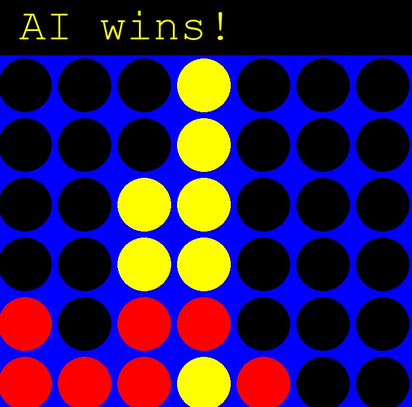
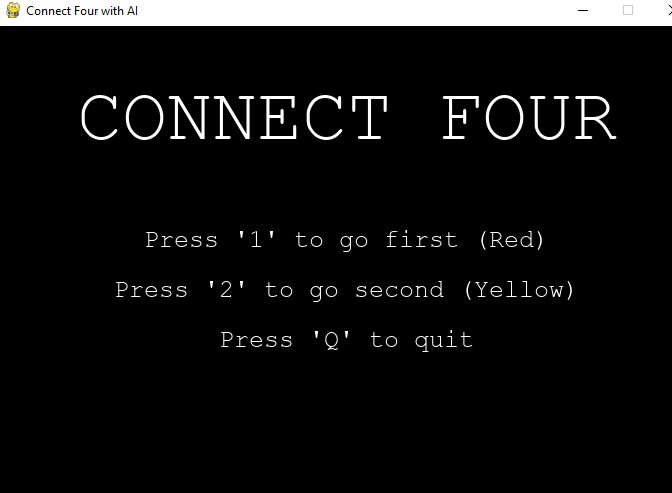

# Connect Four Game (Human vs Computer)

A Python implementation of the classic Connect Four game where you play against an AI opponent. The game features a graphical interface using Pygame and implements the Minimax algorithm with Alpha-Beta pruning for the computer player.

<p align="center">
  
</p>

## 📦 Requirements

You need to have the following installed:
* Python 3.x
* Required libraries:
  * `pygame` - for the game interface
  * `numpy` - for board representation
  * `math`, `random`, `sys` (standard Python libraries)

Install the required packages using:
```bash
pip install pygame numpy
```

## ▶️ How to Run

1. Ensure you have all requirements installed
2. Open your terminal/command prompt
3. Navigate to the game directory
4. Run the command:
```bash
python "connect four.py"
```

## 🎮 How to Play

* You play as Red (Player 1) against the computer (Yellow)
* The game is played on a 6x6 grid
* Click any column to drop your piece
* Pieces fall to the lowest available position in the chosen column
* Win by connecting 4 pieces horizontally, vertically, or diagonally
* Game ends when either:
  * 🔴 Player wins (4 in a row)
  * 🟡 Computer wins (4 in a row)
  * 🤝 Draw (board full)

## 🧠 AI Implementation

The game uses the **Minimax algorithm with Alpha-Beta pruning** for the computer player:

* Evaluates multiple moves ahead
* Uses efficient pruning to reduce calculation time
* Considers:
  * Winning combinations (4 in a row)
  * Blocking opponent's winning moves
  * Strategic positioning (center control)

## 🖼️ Game Screenshots

<p float="left">
  
  
</p>

> 📸 These screenshots show:
> * Initial game state and board layout
> * Gameplay with pieces placed on the board
>
> Screenshots are stored in the `/screenshots` folder.

## 💡 Playing Tips

* Control the center columns when possible
* Watch for diagonal connections
* Block the AI's three-in-a-row immediately
* Try to create multiple winning opportunities
* Think two moves ahead
